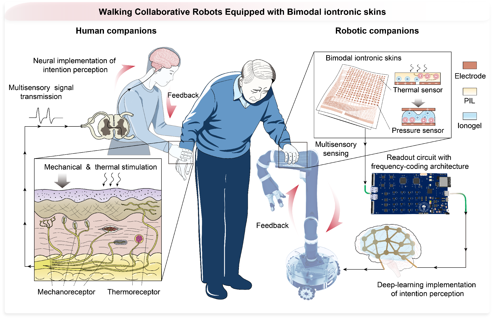
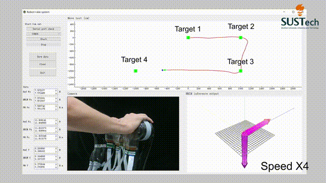

# Walking Collaborative Robots with Bimodal Iontronic Skins for Adaptive Mobility Assistance

 
 

 
 
 

 
 
 

 

  
 

 

## Project introduction: :triangular_flag_on_post:
This project presents a walking collaborative robot equipped with bimodal iontronic skins for adaptive mobility assistance. The iontronic skin integrates pressure and temperature sensors across a large surface area, enabling human-intent-driven control through touch-based interaction. The system employs deep learning algorithms for motion intent recognition and dynamic gesture classification, allowing for intuitive, real-time robotic assistance.

## Description:
This repository contains the source code and documentation for a collaborative robot project. The robot, equipped with bimodal skin perception, is designed to sense user movement intentions and provide adaptive mobility assistance. It includes both software and hardware components for walking motion intent recognition and real-time robotic control. (The file contains the core code blocks of the project)

- "Data Readout System" repository contains readout interface firmware for a sensor array, specifically designed to operate on systems based on the STM32H723VGH6 microcontroller. The included PDF provides details on the hardware components and circuit schematics, while the "./STM32H723VGH6" folder contains control C code developed using Keil5. This firmware facilitates sensor data acquisition and transmission, making it suitable for interactive applications involving various types of sensors.

- "Graphical User Interface" is a high-level interface program developed using Python, leveraging libraries such as PyQt5, PyGraph, and OpenCV. It is designed for sensor debugging, experimental data collection, and analysis. The software features a user-friendly graphical interface that enables real-time interaction with array sensors, facilitating both immediate data visualization and subsequent research on assistive applications.

- "Deep Learning Framework" repository is a PyTorch-based neural network framework for user motion intention inference and interactive gesture recognition using sensor data. It integrates the Hybrid Motion Intention Model (HMIM)—which combines a Vector Mechanics Model (VMM) with a lightweight transformer-based neural network for accurate motion intention prediction—and the 3D Residual Convolutional Network (Res3D) for spatiotemporal feature extraction, enabling precise recognition of dynamic touch gestures. These models empower collaborative robots to interpret human intent, enhance mobility assistance, and ensure adaptive, safe interactions, even in unpredictable conditions.

# Platform:
### The code is intended to run on the following platform:
-Windows
-Linux

### Interface circuitry for sensor signal readout
The 32-bit microcontroller (MCU) STM32H723VGH6 (STMicroelectronics) with a clock speed of 550 MHz was used for the functional control, signal demodulation, and USB transmission. The core operations involved performing fast Fourier transform on mixed frequency signals to demodulate and calculate capacitive responses at different excitation frequencies. The direct digital frequency synthesizer (AD9833, Analog Devices Instruments) generated AC frequency encoded excitation signals. The backend components included an operational amplifier and a high-pass filter, with an output voltage amplitude of 200 mV. The C/V converter uses the precision operational amplifier OPA4388 (Texas Instruments). A 16-bit analog-to-digital converter (AD7606, Analog Devices Instruments) with 8 channels and a conversion rate of up to 200 kSPS was used for collecting voltage in the analog signal chain, supporting demodulation calculations. The analog switch matrix (CH446Q, WCH) handled channel switching within the temperature array.

### Real-time sensory system with a visual user interface
Interactive user software was developed on a computer using Python 3.9 with the PyQt5, PyQtGraph, and OpenCV frameworks. The software supported real-time data transmission via USB or WIFI, enabling waveform visualization, graphical rendering, pressure and temperature map visualization, and data storage.

# IDE:
We recommend using the following integrated development environments (IDEs) to work with this code:

- STM32CUMX
- STM32CubeIDE
- Keil5
- Visual Studio Code

# Prerequisites:
Before you begin, ensure you have met the following requirements:

1、Hardware Requirements:

- STM32H723VGH6 microcontroller-based system
- Compatible sensor array and peripherals
- Development board with debugging interface (e.g., ST-LINK/V2)

2、Software Requirements:

- Keil uVision 5 (for STM32 firmware development)
- STM32CubeMX (for peripheral configuration and initialization)
- Python 3.7+ (for data processing and visualization)
- PyTorch / TensorFlow (for deep learning models)
- Robot Operating System (ROS) (for robotic control and communication)

3、Dependencies:
- Install necessary STM32 drivers and firmware libraries.
- Ensure you have the required compiler toolchains for embedded programming.

# Explanation of Deep Learning Framework

1. Please download all data & codes and then unzip all the folders and place them in the same folder. Dataset download link: https://drive.google.com/drive/folders/1Ehpyk6XMn0UgFS-sOneyP3ZCYR78MxMv?usp=sharing.

### Construction of dataset
The MI dataset included distributed tactile data captured by bimodal iontronic skins during simulations along various motion paths, along with reference data collected from six-axis force/torque sensors recorded at 40 Hz with over 200,000 frames. The data were collected from 12 participants of different ages and movement habits (20-54 years old, 8 men and 4 women), with each participant being tested for four rounds. In each round, the robot remained stationary under high damping, and participants applied the intended control force to the robot according to the guidance of the motion path. The data from the electronic skin was synchronized and collected alongside the real-time data from the ground truth six-axis force/torque sensors. The MI dataset was used to learn and infer the expected forces and torques transmitted by the user through interaction with iontronic skins. The DG dataset included distributed pressure data captured by iontronic skins from 12 participants performing 11 different dynamic touch gestures recorded at 40 Hz for over 50,000 frames, with each gesture repeated for four times. The pressure and touch positions reflected individual habits the participants. Cross-validation was conducted among the participants, with data from two users selected as the test dataset, and 6-fold cross-validation was performed across all users, with the average results being reported.

### Training and optimization of the network model
A transformer-based HMIM neural network was developed to map distributed pressure values from bimodal iontronic skins to motion intention. Being trained with mixed supervision using the Adam optimizer (initial learning rate 0.0001) and MSELoss, the model ran for 10 epochs with a batch size of 40. Additionally, a Res3D network was used to classify dynamic touch gestures from 100-frame tactile data, trained with Adam (learning rate 0.001) and CrossEntropyLoss over 10 epochs. Both models were implemented in PyTorch (Python 3.9) and trained on four NVIDIA T4 tensor core GPUs.

***
Finally, please let us know if you have any comments or suggestions by using our codes & dataset and we would love to hear from you. You can contact us through: 12231066@mail.sustech.edu.cn.
